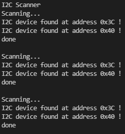

# PRACTICA 5 : Buses de comunicación I (introducción y I2c)


## 5.1:  _ESCÁNER I2C_

- CÓDIGO:
```cpp
#include <Arduino.h>
#include <Wire.h>
void setup()
{
Wire.begin();
Serial.begin(115200);
while (!Serial); // Leonardo: wait for serial monitor
Serial.println("\nI2C Scanner");
}
void loop()
{
byte error, address;
int nDevices;
Serial.println("Scanning...");
nDevices = 0;
for(address = 1; address < 127; address++ )
{
// The i2c_scanner uses the return value of
// the Write.endTransmisstion to see if
// a device did acknowledge to the address.
Wire.beginTransmission(address);
error = Wire.endTransmission();
if (error == 0)
{
Serial.print("I2C device found at address 0x");
if (address<16)
Serial.print("0");
Serial.print(address,HEX);
Serial.println(" !");
nDevices++;
}
else if (error==4)
{
Serial.print("Unknown error at address 0x");
if (address<16)
Serial.print("0");
Serial.println(address,HEX);
}
}
if (nDevices == 0)
Serial.println("No I2C devices found\n");
else
Serial.println("done\n");
delay(5000); // wait 5 seconds for next scan
}

```

- SALIDA POR EL PUERTO SERIE:

  Quando ejecutamos el programa, nos muestra por el serial un scaneo de los dispositivos que utilizan un bus I2C i la rideccion de estos en formato HEXADECIAMAL (HEX) en caso de no haver ninguno se muestra 'No devices found'.
  

  
  
- FUNCIONAMIENTO:
  
  Aqui un listado de los pines assignados:

    | I2C Device | ESP32                    |
    | ---------- | ------------------------ |
    | SDA        | SDA (default is GPIO 21) |
    | SCL        | SCL (default is GPIO 22) |
    | GND        | GND                      |
    | VCC        | usually 3.3V or 5V       |

Para este programa declaramos las librerias de Arduino y de Wire.
```cpp
#include <Arduino.h>
#include <Wire.h>
```
Para empezar el setup inicalizamos el wire i serial port i fijamos la velocidad de monitro a 115200. creamos un loop para escanear el I2C i lo vata mostrando por el serial port.


```cpp
void setup()
{
Wire.begin();
Serial.begin(115200);
while (!Serial); // Leonardo: wait for serial monitor
Serial.println("\nI2C Scanner");
}
```
Despues de eso en el loop principal del programa vamos a declarar la bariables binarias de tipo byte (error) y (adress) i dos ints 'nDevices'.
despues monitoreamos el estado de scanner se inica a 0 nDevices i recorremos la variable adress i se va transmitiendo con al funcion Wire.beginTransmission(adrees);
i error= Wire.endTransmission(); guarda en error si el dispossitivo reconoce la variable adress.
entonces si errror == 0 imprime que lo ha reconocido i su adresss en HEX 
si error==4 imprime que ha havido un error.


Fuera del for, se comprueba el numero de dispositivos encontrados con la variable nDevices, que si esta es 0, entonces se imprime que no se ha encontrado ninfgún dispositivo I2C.

```cpp
void loop()
{
byte error, address;
int nDevices;
Serial.println("Scanning...");
nDevices = 0;
for(address = 1; address < 127; address++ )
{
// The i2c_scanner uses the return value of
// the Write.endTransmisstion to see if
// a device did acknowledge to the address.
Wire.beginTransmission(address);
error = Wire.endTransmission();
if (error == 0)
{
Serial.print("I2C device found at address 0x");
if (address<16)
Serial.print("0");
Serial.print(address,HEX);
Serial.println(" !");
nDevices++;
}
else if (error==4)
{
Serial.print("Unknown error at address 0x");
if (address<16)
Serial.print("0");
Serial.println(address,HEX);
}
}
if (nDevices == 0)
Serial.println("No I2C devices found\n");
else
Serial.println("done\n");
delay(5000); // wait 5 seconds for next scan
}
```